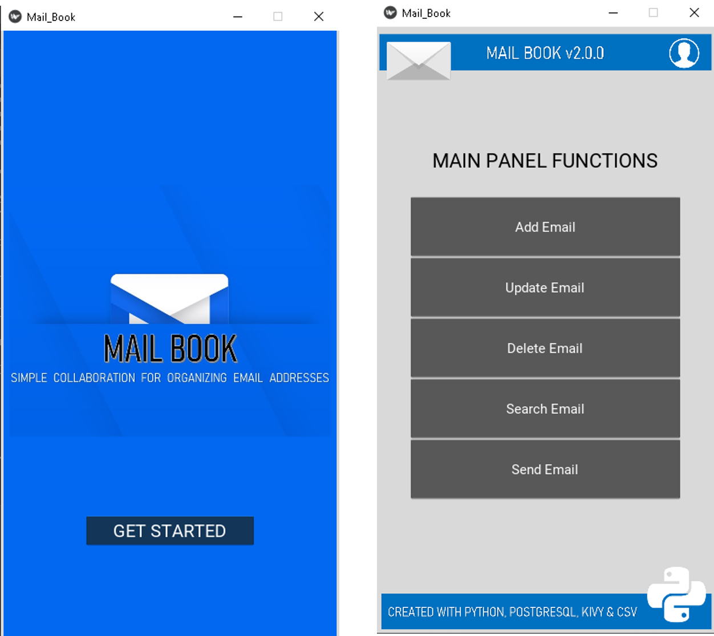
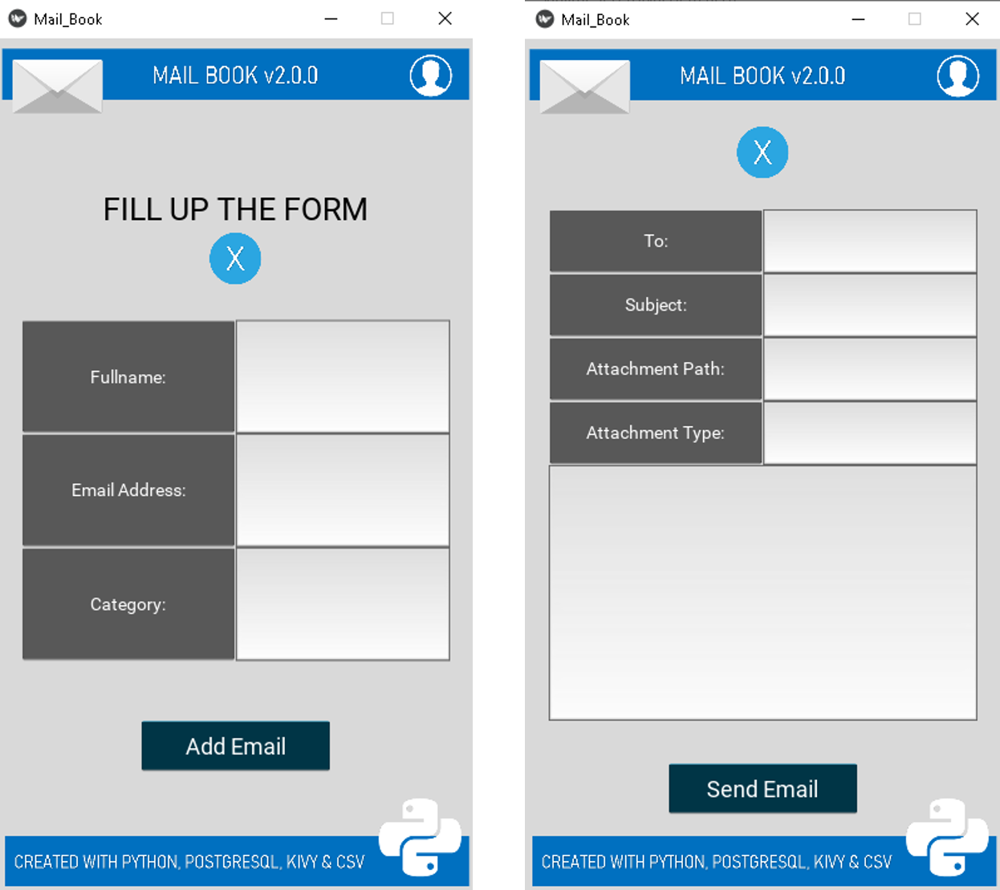
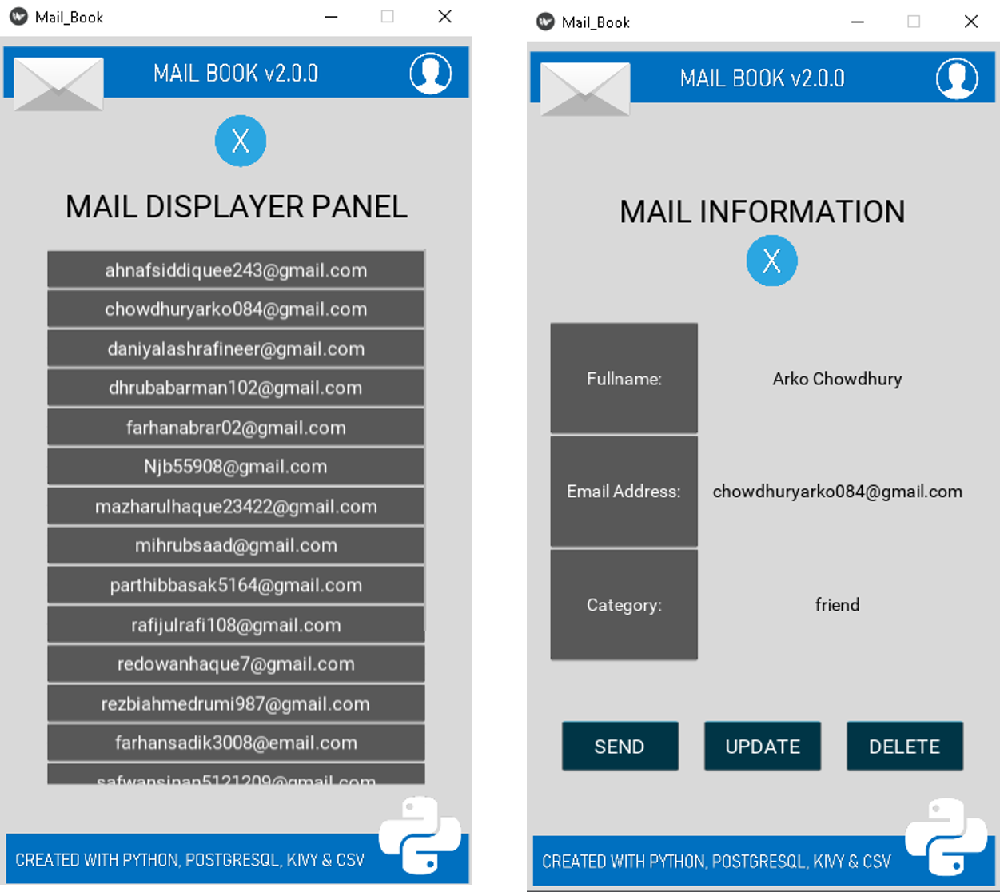

# Mail_Book
Mail_Book is a GUI-based programm which simply helps you to manage your known emails. Using this Mail_Book, you can add, update, search email addresses, and also send email-address. In previous version, you had to operate it using Command-Line, but this from this version you will have a nice multi-platform compatible GUI created with the Kivy framework of Python 3 which will help you to ease your task. Not only that, from now you can even send emails from this application. And this version stores information in PostgreSQL database. However, you can still save information locally in CSV file.

> If you want to use previous version then [click here](https://github.com/ahammadshawki8/Mail_Book/tree/v1.0).

 

# Features
* Graphical User Interface
* Add new emails
* Update existing emails
* Search emails using the name
* Search emails using category/section
* Automatically handles emails of same person
* Send Email from the application
* Stores emails in PostgreSQL Database
* Backup and Restore information locally in CSV file

 

# How to use
* Download and Install [Python 3](https://www.python.org/downloads/) in your device.
* Download and Install [PostgreSQL]() in your device.
* Download [Mail_Book](https://codeload.github.com/ahammadshawki8/Mail_Book/zip/master) repository's zip folder in your device.
* Extract the zip file.
* Install all the dependencies from the [requirements.txt](requirements.txt) file
* Open the [configuration.py](configuration.py) file and change some variables like password, host, port etc.
* Open **[main.py](main.py)** file by double-clicking on it.
* Use the Graphical User Interface and Enjoy.
* Don't forget to see the [demo]() video.
* If you find any difficulty or have any suggestion for future updates, create an [issue](https://github.com/ahammadshawki8/Mail_Book/issues).

 

# Modules
## [resources](resources)
A folder which contains images, csv and text files which are vital for the application.
* ### [contacts](resources/contacts.csv)
    All the emails arre backedup and restored to/from this csv file.
* ### [first](resources/first.txt)
    A text file which only contains a boolean value True/False. At first startup, it is set to True as the application needs to set up the database, after that it automatically toggles to False.
## [requirements](requirements.txt)
All the Python libraries and frameworks that you need to install before running this application.
## [configuration](configuration.py)
Some constants like host, port, user, password that you need to change manually before running this application.
## [database](database.py)
This Python scripts directly speaks with the PostgreSQL database by using the Psycopg2 library.
## [mail](mail.py)
This script is used for sending emails.
## [frontend](frontend.kv)
A Kivy script which supports the main.py script to create the frontend GUI for the application.
## [main](main.py)
This file is basically used for glue code and creating the frontend part of the application, you have to run this file to use the application.

 

# License
Details can be found in [LICENSE](LICENSE)

 

# Screen Shots
Note that here all the mails are imaginary and created using a random mail generator website.

 

 

